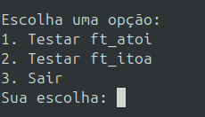

# <a href="#" style="pointer-events: none;"> </a> <a href="https://github.com/AdaoG0n" style="pointer-events: none;"> </a> • Projeto Intchar
<a href="#" style="pointer-events: none;">

</a>

O projeto **Intchar** é uma biblioteca em C que fornece funções para conversão entre inteiros e strings, além de manipulação de memória.<br/>
Este projeto é uma reimplementação de funções padrão da biblioteca C, como `atoi` e `itoa`.</br>

## Funcionalidades

- **ft_atoi**: Converte uma string em um inteiro.
- **ft_itoa**: Converte um inteiro em uma string.
- **ft_bzero**: Preenche um bloco de memória com zeros.
- **ft_calloc**: Aloca memória e a inicializa com zeros.
- **get_num_len**: Retorna o comprimento de um número inteiro.

Para ft_atoi (string para inteiro):

- [ ] Tratamento de espaços em branco iniciai
- [ ] Lidar com sinais (+ ou -)
- [ ] Conversão de caracteres numéricos para valores inteiros
- [ ] Lidar com overflow (números muito grandes)
- [ ] Parar a conversão quando encontrar um caractere não numérico
- [ ] Considerar diferentes bases numéricas (opcional, dependendo dos requisitos)

Para ft_itoa (inteiro para string):

- [ ] Determinar o tamanho necessário para a string resultante
- [ ] Alocação dinâmica de memória para a string
- [ ] Lidar com números negativos
- [ ] Converter dígitos individuais para caracteres
- [ ] Inserir os caracteres na ordem correta na string
- [ ] Adicionar o caractere nulo de terminação
- [ ] Lidar com o caso especial do zero


## Estrutura do Projeto
```
projeto_intchar/
│
├── src/
│   ├── main.c
│   ├── ft_atoi.c
│   ├── ft_itoa.c
│   ├── ft_bzero.c
│   ├── ft_calloc.c
│   └── get_num_len.c
│	
├── include/
│   └── intchar.h
│
├── obj/
│   (pasta vazia para arquivos objeto)
│
├── Makefile
│
└── README.md
```


## Compilação

Para compilar o projeto, utilize o `Makefile` incluído. Execute os seguintes comandos no terminal:

```bash
make            # Compila o projeto e gera o executável
make clean      # Remove arquivos objeto
make fclean     # Remove arquivos objeto e o executável
make re         # Recompila tudo
